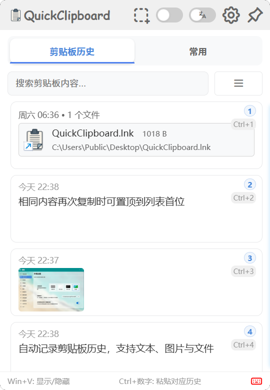
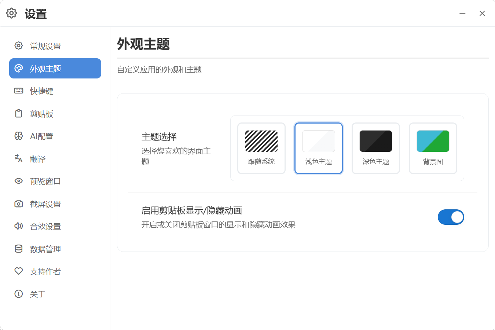
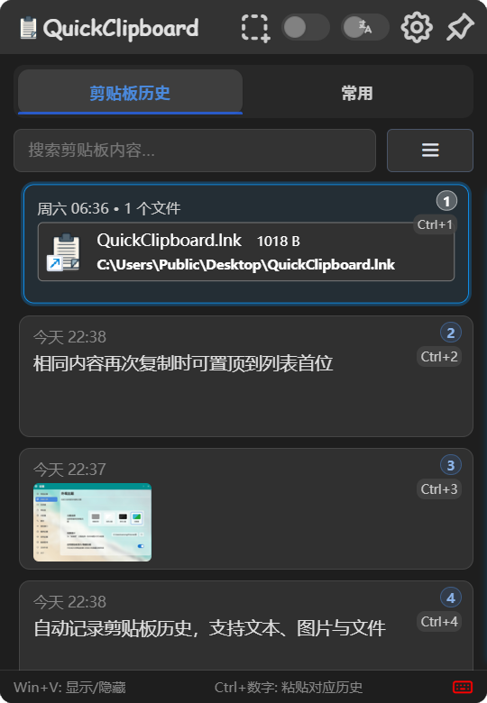
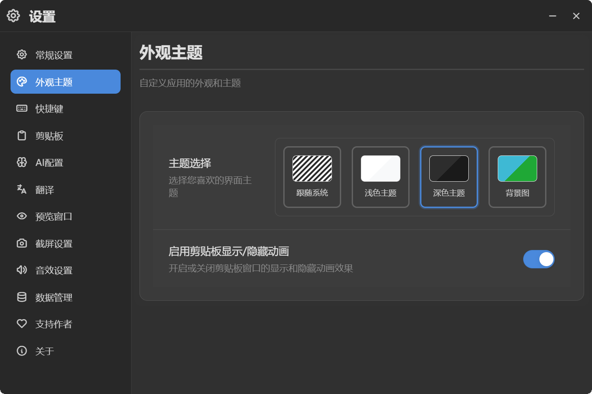
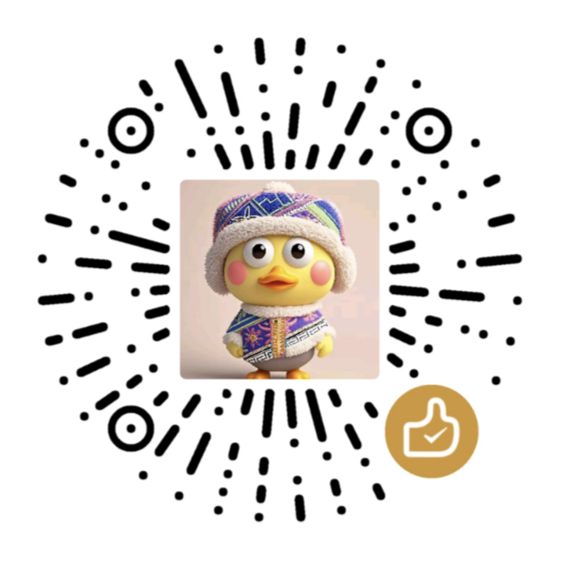

# QuickClipboard 快速剪贴板

<div align="center">
  
  
  <br>
  
  <div style="margin: 16px 0;">
    <a href="https://github.com/mosheng1/QuickClipboard/stargazers">
      
    </a>
    <a href="https://github.com/mosheng1/QuickClipboard/network/members">
      
    </a>
    <a href="https://github.com/mosheng1/QuickClipboard/releases">
      
    </a>
    <a href="https://github.com/mosheng1/QuickClipboard/blob/main/LICENSE">
      
    </a>
  </div>
</div>

---

## 📖 简介

**QuickClipboard** 是一款为 Windows 设计的高效剪贴板管理工具，支持文本、图片与文件的历史记录管理，并配备多种便捷操作方式，让剪贴板使用更加流畅与智能。

---

## 🖼 界面预览

### 🌞 亮色主题
<div align="center">
  
  
</div>

---

### 🌙 暗色主题
<div align="center">
  
  
</div>

---

### 🎨 自定义背景

<div align="center">
  
  
  
  
</div>
<div align="center">
  
  
  
  
</div>


---

## 🔑 主要特性

### 剪贴板管理  
- 自动记录剪贴板历史，支持文本、图片与文件  
- 相同内容再次复制时可置顶到列表首位  
- 常用文本收藏与分组管理，提高复用效率  
- 跨分组排序与快速标签显示  

### 快捷键支持  
- **基础导航**：`Win + V` 打开/隐藏窗口，方向键导航，`Tab` 聚焦搜索框  
- **快速操作**：`Ctrl + Enter` 执行选中项，`Ctrl + 数字` 直接粘贴对应内容，``Ctrl + ` `` 预览内容  
- **分组切换**：`Ctrl + ↑/↓` 快速切换分组  

### 截图功能  
- `Ctrl + Shift + A` 一键截图并保存到历史记录  
- 兼容多显示器与不同分辨率缩放  
- 智能选区与流畅拖拽体验  

### 数据与存储  
- 基于 SQLite 保存数据，支持旧版本数据迁移  
- 提供数据导入与导出，方便跨设备同步  

### 界面与交互  
- 窗口位置可智能调整  
- 流畅的显示与收起动画  
- 支持图片预览、日期显示、滚动条位置调整  
- 托盘集成与单实例运行  

---

## 💻 系统要求
- Windows 10/11 (x64)  
- .NET Framework 4.7.2 或更高版本  

## 📦 下载方式

> 提供多种安装包选择，满足不同用户需求

| 安装包类型 | 说明 | 下载量 | 下载链接 |
|------------|------|--------|----------|
| **NSIS 安装包**<br>`QuickClipboard_0.0.5_x64-setup.exe` | 适合大多数用户，支持快速安装与卸载 |  | [](https://github.com/mosheng1/QuickClipboard/releases/download/v0.0.5/QuickClipboard_0.0.5_x64-setup.exe) |
| **MSI 安装包**<br>`QuickClipboard_0.0.5_x64_zh-CN.msi` | 适合企业环境，可用于批量部署 |  | [](https://github.com/mosheng1/QuickClipboard/releases/download/v0.0.5/QuickClipboard_0.0.5_x64_zh-CN.msi) |
| **绿色版**<br>`QuickClipboard_0.0.5.exe` | 免安装，解压即可使用 |  | [](https://github.com/mosheng1/QuickClipboard/releases/download/v0.0.5/QuickClipboard.exe) |
| **网盘下载** | 备用下载渠道，适合 GitHub 访问较慢时使用 | — | [](https://www.123912.com/s/A9Ckjv-Vu75v?pwd=UhWA#) |


---

## 💖 赞赏支持

<div align="center">
  <p>如果你觉得本项目对你有帮助，欢迎扫描下方二维码赞赏支持开发~</p>
  
</div>

---

## 🚀 快速上手
1. 下载并安装 QuickClipboard  
2. 使用 `Win + V` 打开剪贴板窗口  
3. 在设置中根据需求进行个性化配置  

---

## 🛠 开发与构建
### 环境需求
- Node.js ≥ 16.0.0  
- Rust ≥ 1.70.0  
- Tauri CLI ≥ 2.0.0  

### 命令示例
```bash
# 安装依赖
npm install

# 开发模式启动
npm run tauri dev

# 构建应用
npm run tauri build
